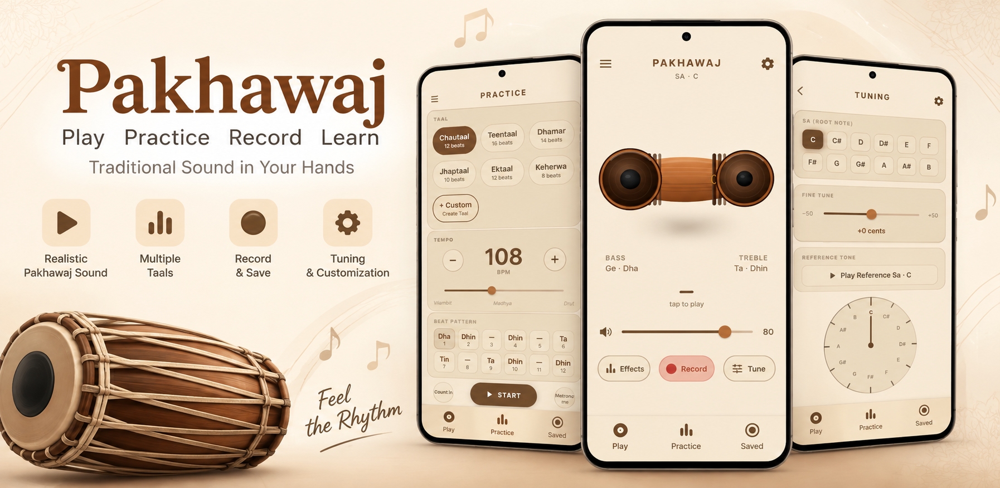

# Real Pakhawaj: Authentic Tabla & Percussion Riyaz App 🥁🚀

  

---

## 🎵 About The App
If you practice **Dhrupad, Haveli Sangeet, or Kathak**, you know how hard it is to find a reliable Pakhawaj accompanist for daily *riyaz*. Most virtual drum apps use fake MIDI sounds and suffer from terrible audio latency.

**Real Pakhawaj & Tabla Riyaz** is engineered differently. We use **high-fidelity acoustic samples** recorded in a professional studio. Our custom audio engine ensures **zero-latency playback**, allowing the rhythm to stay perfectly synchronized from Vilambit (slow) to Drut (fast) tempos.

## ✨ Key Features
- 🎙️ **Authentic Studio Sounds:** Real acoustic *bols* (Ge, Dha, Dhin, Ta) instead of robotic MIDI beats.
- 🎛️ **Micro-Tonal Pitch Tuning:** Calibrate the root pitch (Sa) in exact cents to flawlessly match your physical Tanpura or vocal scale.
- 🎼 **Classical Taals Included:** Specifically designed for Dhrupad practitioners. Play taals like **Chautaal, Dhamar, Sooltaal, and Tivra**.
- 🚀 **Zero-Latency Engine:** Uninterrupted, perfectly timed rhythmic loops.
- 📴 **100% Offline Mode:** Practice anywhere without relying on an internet connection.

---

## 📥 Download
Ready to elevate your daily practice? Download the app for free on Android:

👉 **[Download Real Pakhawaj on Google Play](https://play.google.com/store/apps/details?id=com.realpakhawaj.pakhawaj_app)**

---

## 🐛 Bug Reports & Feedback
We created this GitHub repository as a public issue tracker to directly listen to our users. 
Please open a new issue in the **[Issues Tab](../../issues)** for bugs or feature requests!
